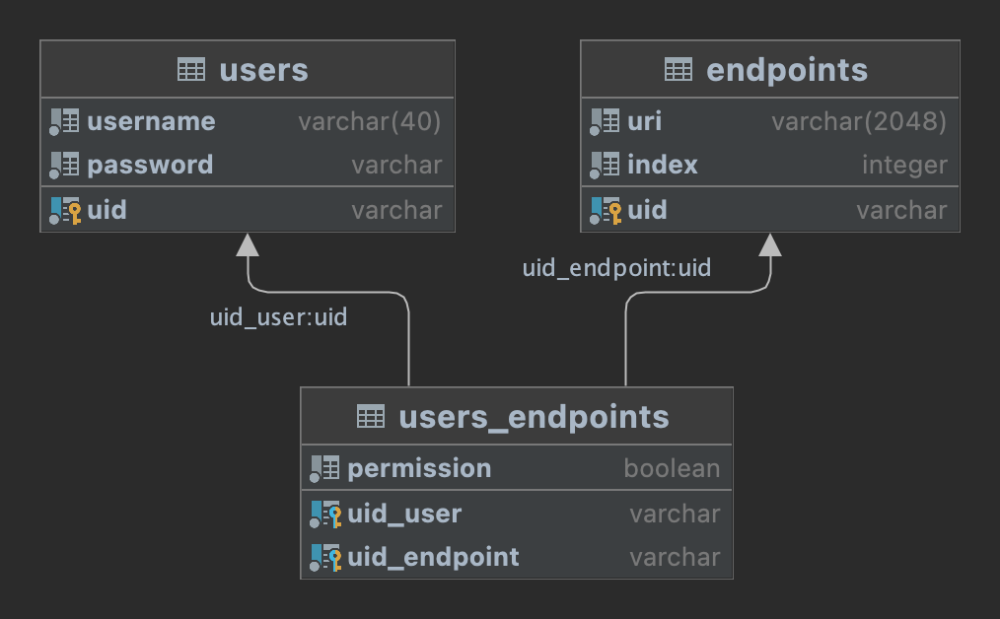
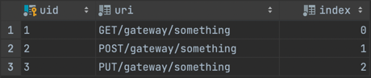
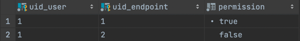

# Binary authorization

### 1. Introduction
In this tutorial, I'll show you how with binary model authorization we can speed up our application
to checking API endpoints only by getting a binary number field from a JWT and
having a list of all API endpoints of application. Also, with this binary number web-application
can operate with a visualization of buttons.

### 2. Overview
Assuming we are developing something REST service, and we want to check user's permissions for specific endpoints.

Suppose we have next endpoints in our REST service:
```text
(GET)  /gateway/something
(POST) /gateway/something
(PUT)  /gateway/something
```
And something user must have only one permission for `(GET)  /gateway/something` endpoint.

Here is the database schema:


Here is filled tables:

users:


endpoints:



users-endpoints:



User with the name "Bob" has permission for URI GET/gateway/something, and hasn't for others.

Based on these tables we can create for Bob some binary number `100` related on his permissions,
where count signs equal the size of all endpoints in table `endpoints`.
```
1 - has permission for 0-index (GET/gateway/something),
0 - hasn't permission for 1-index (POST/gateway/something),
0 - hasn't permission for 2-index (PUT/gateway/something)
```
Count of endpoints can be very large, and we can translate it to decimal
number. So, we have instead the binary number `100` we have the decimal number `4`

### 3. Build binary-authorization

Before build JWT we must create binary-authorization field:

```java
    public Integer buildBinaryPermission(final UserEntity userEntity, Map<String, Integer> allEndpoints) {
        StringBuilder stringBuilder = new StringBuilder(StringUtils.repeat("0", allEndpoints.size()));

        userEntity.getUserEndpoints()
                .forEach(userEndpoint -> {
                    Integer index = allEndpoints.get(userEndpoint.getEndpoint().getUri());
                    if (index != null && userEndpoint.isPermission()) {
                        stringBuilder.setCharAt(index, '1');
                    }
                });
        return Integer.parseInt(stringBuilder.toString(), 2);
    }
```
First, we must build a line with zeros with length equal all endpoints, in our case it is `000`.

```java
StringBuilder stringBuilder = new StringBuilder(StringUtils.repeat("0", allEndpoints.size()));
```

The parameter `allEndpoints` is Map with key as URI of endpoint and value as index of endpoint.
For example,
```
('GET/gateway/something', 0)
('POST/gateway/something', 1)
('PUT/gateway/something', 2)
```
And in the loop we check available user's endpoints `userEntity.getUserEndpoints()` with and if permission is true then change zero on one by index of endpoint.

### 4. Check user permission

To simplify I am skipping parsing JWT, and here is user's principals:

```java
public class PrincipalDto {
    
    private String userUid;
    private String username;
    private Integer binaryPermission;
    
}
```

Before we start to check permission we must think a strategy for quickly get all endpoints of application.
It is desirable that the search has constant complexity O(1) and it can be stored in REDIS or in memory application.
And below method `endpointService.findIndexByUri(...)` executes search endpoints.

In a OncePerRequestFilter we are checking user's request URI:

```java
    Integer binaryPermission = principalDto.getBinaryPermission();
    Optional<Integer> endpointIndex = endpointService.findIndexByUri(request.getMethod() + request.getRequestURI());

    if (endpointIndex.isEmpty()) {
        filterChain.doFilter(request, response);
        return;
    }

    if (authenticationService.checkPermission(binaryPermission, endpointIndex)) {
        filterChain.doFilter(request, response);
    } else {
        throw new ForbiddenException("Not permission!");
    }
```

Here we find index of endpoint by user's request and check permission by field `binaryPermission`: 

```java
   public boolean checkPermission(Integer binaryPermission, Optional<Integer> endpointsIndex) {
        if (endpointsIndex.isEmpty()) return false;

        String binaryString = Integer.toBinaryString(binaryPermission);
        char value = binaryString.charAt(endpointsIndex.get());
        return value == '1';
    }
```

### 5. Conclusion
This article illustrated how to check user's binary model authorization for API endpoints using Spring.
Thanks for reading!